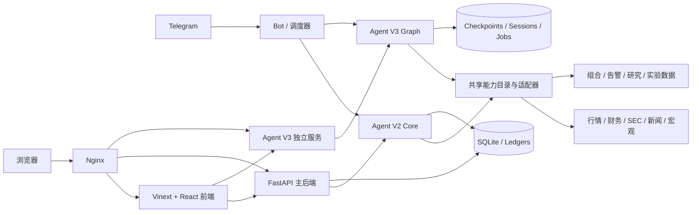
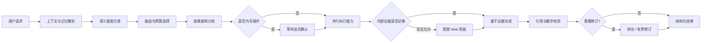
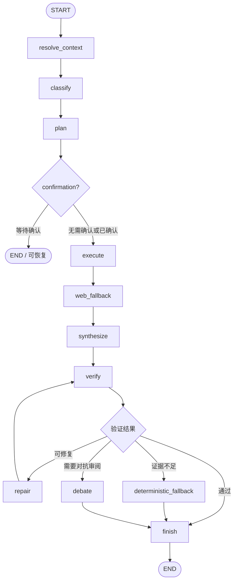

# Market Intelligence Workbench

面向美股研究、组合监控与可验证 AI 分析的一体化工作台。

本项目把行情、持仓、财务、SEC 文件、机构持仓、宏观、新闻与产业链等信息汇入统一界面，并提供两套相互独立、共享证据能力的智能体架构：

- **Agent V2**：稳定、证据优先的生产级执行管线，适合大多数网页和 Telegram 请求。
- **Agent V3**：基于 LangGraph 的显式状态图与可恢复执行架构，适合复杂、多步骤和需要严格编排的任务。

> [!IMPORTANT]
> 本项目用于研究、学习和辅助决策，不构成投资建议。行情可能受数据源权限、交易时段和延迟影响。交易相关功能应默认使用模拟账户，并在人工确认后执行。

## 主要能力

### 盯盘

- 组合净值、当日收益、回撤、现金和持仓风险
- 可配置市场行情滚动条
- 盘中异动归档与最近两个交易日回看
- 价格提醒创建、触发与独立展示
- 监控股票池、持仓和 Watchlist 管理
- 持仓价格曲线、OHLCV K 线、SMA、成交量与多级支撑阻力
- 行情时段区分：盘前、正常交易、盘后和已收盘
- 服务调用量与费用估算

### 研究

- 个股综合工作台
- 公司与基本面
- 估值与同行比较
- 财报、SEC 文件与风险因素
- 预期、盈利动量与催化剂
- 机构持仓与内部人活动
- 资金流、宏观环境与产业链
- 风险雷达与结构化研究结论
- 价格曲线和 K 线联动分析

### 实验室

- 策略回测
- 事件研究
- 股票筛选
- 信号候选与运行记录
- 研究结果隔离，避免实验结果直接改变生产持仓或告警

### 多端入口

- Web 工作台
- Telegram Bot
- 定时任务与行情流处理器
- FastAPI 接口

## 系统架构



生产部署中，主后端和 Agent V3 使用不同的进程与端口。Agent V3 没有独立网页，它通过现有工作台和 Bot 被调用。

## Agent V2：证据优先的生产执行管线

Agent V2 的目标是：**先理解请求，再规划工具调用；先形成证据，再生成答案；最后校验引用和数字。** 它不依赖特定 UI，也不把 Telegram 或网页逻辑写进核心执行器。

### 执行流程



### 稳定契约

Agent V2 使用明确的数据契约连接路由、计划、执行、证据和输出，主要包括：

- `NormalizedRequest`：规范化后的用户请求和上下文。
- `RouteDecision`：路由类型、置信度、预算和回答模式。
- `ExecutionPlan` / `PlanTask`：任务依赖、并行分支和 fan-out 定义。
- `ToolEnvelope` / `EvidenceItem`：工具结果、来源、时间、质量和证据标识。
- `VerificationReport`：引用、数字溯源、冲突和警告。
- `PendingMutation`：等待用户确认的写操作。
- `AgentResult`：状态、答案、证据、进度和诊断信息。

核心状态覆盖 `received`、`planned`、`executing`、`verifying`、`completed`、`partial`、`failed` 等阶段；工具结果也会区分成功、部分数据、部分错误、缓存、跳过和失败。

### 语义路由与计划

V2 根据语义意图路由，而不是依赖简单关键词匹配。请求会被划分为知识问答、快速查询、研究、实验、命令或异步任务，并选择对应预算：

- `direct`：单次直接查询
- `focused`：小范围研究
- `standard`：常规多源研究
- `comparison`：多标的比较
- `portfolio`：组合级分析
- `lab`：实验任务
- `deep`：长时间、可异步的深度任务

计划器支持依赖图和有限并行，默认最大并行度为 4。低置信度请求会先要求澄清，而不是猜测用户意图。

### 能力目录

V2 通过统一能力目录调用实际工具，典型能力包括：

- 账户、持仓、组合收益和风险
- 个股研究、横向比较和变化检测
- 市场表现、回撤、上涨和异常解释
- SEC 文件、历史异常和机构 13F
- ARK、宏观、新闻和产业链研究
- 监控状态读取、价格提醒与受控写操作
- 回测、事件研究和筛选
- 有界的外部 Web 研究

能力适配器负责把不同数据源转换为统一证据格式，避免模型直接依赖某个供应商的原始响应。

### 证据、校验与回答模式

`EvidenceLedger` 记录证据 ID、来源和冲突。答案可以被标记为：

- `tool_grounded`：由内部工具数据支撑
- `research_grounded`：由研究引擎结果支撑
- `web_grounded`：由允许的外部检索支撑
- `general_knowledge`：通用知识回答
- `mixed`：多类证据混合
- `insufficient_evidence`：证据不足

校验器检查：引用是否存在、答案中的数字能否回溯到证据、不同工具是否互相冲突，以及是否需要向用户显示数据不完整或过期警告。

### 会话、记忆与多端一致性

- 网页与 Telegram 共用同一套 Agent V2 Core。
- Web 适配器返回结构化 JSON；Telegram 适配器负责进度消息和传输格式。
- 会话状态支持追问、指代解析、最近证据复用和用户偏好。
- 记忆、意图、质量、能力调用和子任务记录可写入 SQLite 或 ledger 文件。

### 写操作安全

默认 `allow_mutations=false`。添加提醒、改变监控范围或其他会修改状态的操作会先生成 `PendingMutation`，只有用户明确确认后才执行。自动化和测试只有在受信任环境中才能显式开启写权限。

Web 兜底同样默认关闭，必须同时满足服务端允许和当前请求允许，才会访问外部网络。

## Agent V3：显式状态图与可恢复编排

Agent V3 不是给 V2 换一个提示词，而是一套独立的 LangGraph 执行架构。它复用已经验证的能力适配器、证据账本和校验器，但**不会调用 V2 的执行器**。

它适合以下场景：

- 复杂的多步骤研究
- 需要清晰依赖关系和动态 fan-out 的任务
- 需要中断恢复、任务轮询或严格状态审计的长任务
- 需要专家子流程、审阅和修复循环的分析

### 主状态图



每个节点都读写经过 Pydantic 校验的 JSON 状态。页面上下文、选中的异常、价格提醒、市场状态和会话引用会在进入分类与规划之前完成解析。

### 严格计划与 DAG 执行

V3 对计划实施更严格的边界：

- 单个计划最多 12 个基础任务
- 任务 ID 必须唯一，依赖必须存在，禁止循环依赖
- fan-out 有明确上限
- 扩展后的任务总数和后续任务数受限
- 写操作不能与其他分支并行展开
- 依赖失败时，要求该依赖的任务会被跳过
- 支持截止时间、取消信号和并行度限制

执行器使用 LangGraph `Send` 调度就绪任务，根据前序结果进行有限动态展开。这样可以并行查询互不依赖的数据，同时保持可重放和可审计性。

### 专家工作流

Agent V3 可以注册受约束的专家流程，例如：

- 公司与财务研究
- 新闻和催化剂研究
- SEC 文件与风险因素
- 组合影响与风险分析
- 结果审阅与对抗辩论

专家输出使用固定 schema，不直接返回任意自由文本。专家可访问的工具、轮次和预算由中间件限制，最终仍需进入统一证据账本和校验阶段。

### 修复、降级与辩论

- 校验不通过时最多进行有限次数修复，默认上限为 2。
- 模型不可用或证据不足时，可生成确定性降级结果，而不是让任务无限重试。
- 对高风险或冲突结论，可启用 adversarial debate，再执行一次有界修订。
- 所有路径最终归一为同一套结构化 `AgentResult`。

### 持久化与恢复

V3 为长任务提供独立持久化层：

- LangGraph checkpoint 保存图执行位置。
- `SessionStore` 保存有 TTL 的会话状态和确认请求。
- `JobJournal` 保存网页后台任务，支持轮询和受控重试。
- 服务重启后，可恢复被中断的只读图任务。
- 写操作在产生副作用前记录 mutation journal；状态不确定的写操作不会被静默重放。

生产环境建议让 Agent V3 使用独立虚拟环境、进程、端口和数据目录，避免其依赖或长任务影响主后端。

## Agent V2 与 Agent V3 的关系

| 维度 | Agent V2 | Agent V3 |
| --- | --- | --- |
| 定位 | 稳定、证据优先的默认生产管线 | 显式图编排与可恢复复杂任务 |
| 核心实现 | 框架无关的路由、计划和执行器 | LangGraph 状态图与 DAG 调度 |
| 默认入口 | 网页默认 Agent、Telegram 常规请求 | 网页可选 Agent、后台复杂任务 |
| 计划执行 | 依赖感知、有限并行 | 严格图校验、动态 fan-out、有限并行 |
| 状态 | 会话、记忆和各类 ledger | checkpoint、session、job、mutation journal |
| 恢复 | 会话级追问与证据复用 | 图级中断恢复与后台任务重试 |
| 写操作 | `PendingMutation` + 明确确认 | 图确认节点 + mutation journal |
| Web 兜底 | 双重开关、按需启用 | 图节点控制、默认关闭 |
| 证据与校验 | 原生 EvidenceLedger + Verifier | 复用同一证据与校验语义 |
| 专家流程 | 能力目录中的专用适配器 | schema 约束的专家子流程与审阅 |

两者不是新旧页面的重复实现。V2 提供稳健默认路径，V3 提供更强的编排、恢复和审计能力；底层共享数据能力和证据标准，避免产生两套互不一致的研究事实。

## 项目结构

```text
market-intelligence-workbench/
├─ ai-workbench/               # Vinext + React Web 前端
├─ web/
│  ├─ backend/                 # FastAPI 主后端、路由、服务与测试
│  ├─ deploy/                  # Nginx、systemd 与部署脚本
│  └─ tests/                   # Web 集成测试
├─ v2/
│  ├─ agent_common/            # V2/V3 共享契约、证据和基础能力
│  ├─ agent_v2/                # Agent V2 核心、适配器与测试
│  ├─ agent_v3/                # Agent V3 图、运行时、持久化与测试
│  ├─ research/                # Research Engine
│  ├─ extensions/              # 数据与领域扩展
│  └─ telegram/                # Telegram 集成
├─ scripts/                    # Bot、调度器、流处理器、质量门与运维脚本
├─ .github/workflows/          # Agent V2 / V3 CI 质量门
├─ .env.example                # 环境变量模板，不包含真实密钥
├─ pyproject.toml              # Python / Poetry 依赖
└─ poetry.lock                 # 锁定依赖版本
```

运行时数据库、日志、缓存、构建产物和 `.env` 已通过 `.gitignore` 排除，不应提交到公共仓库。

## 本地运行

### 前置条件

- Python 3.11+
- Poetry 2.x
- Node.js 22.13+
- npm

### 1. 获取代码

```bash
git clone https://github.com/YuhanWang03/market-intelligence-workbench.git
cd market-intelligence-workbench
```

### 2. 配置环境变量

Linux / macOS：

```bash
cp .env.example .env
```

Windows PowerShell：

```powershell
Copy-Item .env.example .env
```

然后在 `.env` 中填写自己拥有的数据源和模型密钥。不要提交 `.env`，也不要在浏览器端暴露 `WEB_OWNER_TOKEN` 或供应商密钥。

首次自托管可使用 `WEB_ADMIN_USERNAME` 配置登录用户名，并优先使用
`WEB_ADMIN_PASSWORD_HASH` 配置独立的 PBKDF2 密码摘要。尚未配置密码摘要时，
系统会把 `WEB_OWNER_TOKEN` 临时作为所有者登录密码，便于从旧版本平滑迁移；
生产环境仍建议尽快改为独立密码摘要与随机 `WEB_SESSION_SECRET`。

### 3. 安装后端依赖

```bash
poetry install --no-root
```

### 4. 启动主后端

Linux / macOS：

```bash
PYTHONPATH="$PWD/web/backend:$PWD" poetry run uvicorn app.main:app --app-dir web/backend --host 127.0.0.1 --port 8100 --reload
```

Windows PowerShell：

```powershell
$env:PYTHONPATH = "$(Get-Location)\web\backend;$(Get-Location)"
poetry run uvicorn app.main:app --app-dir web/backend --host 127.0.0.1 --port 8100 --reload
```

健康检查：`http://127.0.0.1:8100/api/health`

### 5. 启动前端

```bash
cd ai-workbench
npm ci
npm run dev
```

打开 `http://localhost:3000`。

## 配置说明

`.env.example` 是基础模板。不同功能需要的变量不同，可按实际使用范围补充：

| 类别 | 常用变量 | 用途 |
| --- | --- | --- |
| 通用模型 | `AGENT_LLM_MODEL`, `AGENT_LLM_BASE_URL`, `AGENT_LLM_API_KEY` | Agent V2 及共享模型入口 |
| 模型供应商 | `DEEPSEEK_API_KEY`, `OPENAI_API_KEY` | DeepSeek、OpenAI 兼容能力或 Embedding |
| Agent V3 | `AGENT_V3_MODEL`, `AGENT_V3_BASE_URL`, `AGENT_V3_API_KEY`, `AGENT_V3_THINKING` | V3 独立模型配置 |
| 财务数据 | `FINANCIAL_DATASETS_API_KEY` | 财务、价格和公司数据 |
| 搜索 | `TAVILY_API_KEY` | 新闻和外部研究检索 |
| 宏观 | `FRED_API_KEY` | FRED 宏观数据 |
| SEC | `EDGAR_IDENTITY`, `SEC_USER_AGENT` | SEC/EDGAR 合规身份标识 |
| 券商 | `APCA_API_KEY_ID`, `APCA_API_SECRET_KEY`, `APCA_PAPER` | Alpaca 模拟或授权账户 |
| Telegram | `TELEGRAM_CHAT_ID`, `TELEGRAM_WEB_DEFAULT` | Bot 推送与默认行为 |
| Web 登录 | `WEB_ADMIN_USERNAME`, `WEB_ADMIN_PASSWORD_HASH`, `WEB_SESSION_SECRET` | 所有者账号、密码摘要和签名会话密钥 |
| Web 兼容鉴权 | `WEB_OWNER_TOKEN` | 内部进程调用令牌；未设置密码摘要时兼作初始登录密码 |
| 访客快照 | `WEB_GUEST_ENABLED`, `WEB_PUBLIC_SNAPSHOT_DB` | 启用只读访客入口并设置独立快照库路径 |
| 功能开关 | `AGENT_V2_WEB_ENABLED`, `AGENT_V3_WEB_ENABLED` | 是否允许智能体使用 Web 兜底 |
| 状态路径 | `WEB_ARCHIVE_DB`, `WEB_LAB_DB`, `AGENT_V2_SESSION_DB`, `AGENT_V3_DATA_DIR` | 自定义持久化位置 |

没有配置某个付费数据源时，对应能力可能返回部分数据或降级结果，但不应伪造内容。费用页面仅根据实际记录到的 token、credit 和请求量估算，供应商账单仍是最终依据。

## 所有者与访客模式

网页入口提供两种访问方式：

- **所有者登录**：可以刷新实时数据、运行研究与实验、管理监控列表，并使用 Agent V2 / V3。所有可能产生费用或修改状态的能力只向所有者开放。
- **访客只读**：只能读取所有者最近发布到独立 SQLite 快照库的数据。访客请求不会进入实时行情、模型、搜索、财务数据或券商接口。

所有者在网页中刷新或打开允许公开的页面时，前端会把响应保存为公开快照。盯盘可展示 Paper Account 持仓；研究页的公开快照限定为 NVDA；实验室和花费页只展示已发布结果。访客不能刷新、提交表单、调用智能体或修改监控配置。后端同时设有全局访问拦截，因此隐藏按钮并不是唯一安全措施。

公开 GitHub 仓库只提供源代码和 `.env.example`。其他人可以填入自己的 API Key 独立部署，但无法通过你的公开演示站点消耗你的密钥。快照数据库、真实 `.env` 和会话密钥都不得提交到 Git。

## 单独运行智能体

### Agent V2 演示

```bash
poetry run python -m v2.agent_v2.run_demo
```

主后端提供：

- `POST /api/agent-v2/ask`
- `GET /api/agent-v2/jobs/{job_id}`

### Agent V3 演示与独立服务

为保持依赖隔离，建议创建单独环境：

```bash
python -m venv .venv-agent-v3
.venv-agent-v3/bin/pip install -r v2/agent_v3/requirements.lock
.venv-agent-v3/bin/python -m v2.agent_v3 --demo
```

Windows 请将 `.venv-agent-v3/bin/python` 和 `pip` 替换为 `.venv-agent-v3\Scripts\python.exe` 和 `.venv-agent-v3\Scripts\pip.exe`。

独立 API 服务：

```bash
.venv-agent-v3/bin/python -m uvicorn agent-v3-server:app --app-dir web/deploy --host 127.0.0.1 --port 8104
```

主要接口：

- `POST /api/agent-v3/ask`
- `GET /api/agent-v3/jobs/{job_id}`
- `POST /api/agent-v3/jobs/{job_id}/retry`

网页任务默认以后台 job 运行，调用方通过 job ID 获取进度和结果。

## Bot、调度器与行情任务

```bash
poetry run python scripts/run_telegram_bot.py
poetry run python scripts/run_scheduler.py
poetry run python scripts/run_streamer.py
```

这些进程应使用同一份受保护的服务端环境配置。生产环境建议由 systemd 或等效进程管理器负责启动、重启和日志轮转。

## 测试与质量门

后端测试：

```bash
poetry run pytest web/backend/tests -q
```

Agent V2 质量门：

```bash
poetry run python scripts/agent_v2_gate.py
```

Agent V3 测试：

```bash
.venv-agent-v3/bin/python -m pytest v2/agent_v3/tests v2/agent_common -q -p no:cacheprovider
```

前端检查：

```bash
cd ai-workbench
npm run lint
npm run build
```

GitHub Actions 会分别运行 Agent V2 和 Agent V3 的质量门。新增能力时应同时补充契约测试、数据源失败测试和不完整证据测试。

## 生产部署

仓库中的 `web/deploy/` 包含 Nginx、systemd 和重新部署所需的配置与脚本。推荐拓扑：

| 服务 | 默认监听 | 说明 |
| --- | --- | --- |
| 前端 | `127.0.0.1:3000` | Vinext 生产服务 |
| 主后端 | `127.0.0.1:8100` | Dashboard、Research、Lab、Agent V2 |
| Agent V3 | `127.0.0.1:8104` | 独立环境与持久化目录 |
| Nginx | `80/443` | 统一入口与反向代理 |

建议部署目录为 `/root/market-intelligence-workbench` 或专用非 root 服务目录，并遵循：

1. 从 Git 仓库执行 fast-forward 更新。
2. 使用服务器本地 `.env`，不要从 GitHub 下发真实密钥。
3. 前端安装锁定依赖并构建。
4. 主后端和 Agent V3 分别安装依赖。
5. 运行测试和健康检查后再重启服务。
6. 保留数据库备份和上一版本回滚目录。

## 数据语义与可靠性原则

- 行情记录应携带 symbol、timestamp、source、session、isDelayed 和 isFinal。
- 正常交易、盘前、盘后和已收盘价格必须明确区分。
- OHLC、均线和支撑阻力使用一致的拆股调整口径。
- 图表隐藏指标只影响显示，不影响后台计算和 AI 结构化输入。
- 数据缺失时返回 `partial_data` 或 `insufficient_evidence`，禁止用示例数据冒充真实结果。
- 外部数据可能存在延迟；页面应展示来源、时间和状态。

## 安全与公开仓库注意事项

- 不要提交 `.env`、数据库、日志、缓存、导出报告或供应商响应原文。
- 公开前检查 Git 历史；仅从工作区删除密钥不能清除历史版本中的秘密。
- 如果密钥曾经进入 Git 历史，应先吊销并轮换，再清理历史。
- `WEB_OWNER_TOKEN` 仅用于服务端鉴权，不应写入前端 bundle。
- 不要在浏览器 `localStorage` 保存所有者令牌；网页登录使用签名的 HttpOnly 会话 Cookie。
- 生产环境应使用独立 `WEB_ADMIN_PASSWORD_HASH`、高强度 `WEB_SESSION_SECRET` 和 HTTPS；启用 HTTPS 后将 `WEB_COOKIE_SECURE=true`。
- 访客只能读取独立发布快照；新增业务路由仍应显式依赖所有者权限，不能只依靠前端禁用按钮。
- SEC 抓取必须设置可识别的 `EDGAR_IDENTITY` / `SEC_USER_AGENT` 并遵守访问规则。
- 实盘交易属于高风险写操作，不应绕过人工确认和券商风控。

## 贡献

欢迎通过 Issue 或 Pull Request 提交改进。建议每个变更：

1. 说明影响的页面、智能体节点或能力。
2. 保持 V2/V3 共享契约向后兼容，或提供迁移说明。
3. 为成功、部分数据和供应商失败路径添加测试。
4. 不在测试夹具、日志和截图中包含真实密钥或账户信息。

## 许可证

本项目采用 [MIT License](LICENSE)。部分基础工作源自原 AI Hedge Fund 教育项目，具体版权声明见许可证文件。
