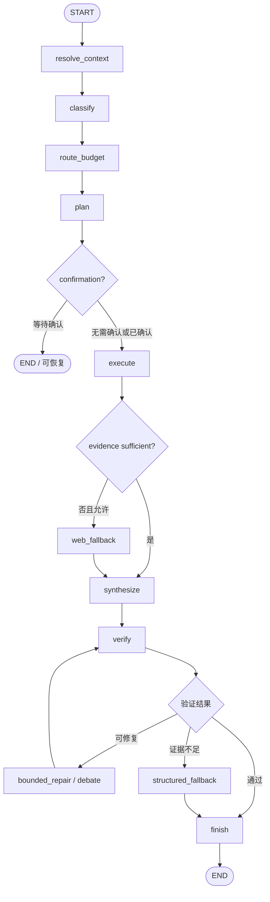

# Agent V2

Agent V2 是 Market Intelligence Workbench 当前默认的证据优先执行管线。它负责理解请求、选择能力、执行工具、汇总证据、生成回答并校验引用与数字，可由 Web 工作台和 Telegram 共同调用。

> [!WARNING]
> **本系统仍在调整过程中，正式测评尚未完成。** 目录中的单元测试、契约测试、离线固定样例和 benchmark/quality 工具是开发与回归基础设施，不代表已经完成真实场景下的模型质量测评，也不构成投资系统有效性证明。

## 设计目标

- 先收集可追溯证据，再生成结论。
- 将路由、计划、工具执行、证据、合成和校验拆成清晰契约。
- 在 Web 与 Telegram 之间复用同一核心逻辑。
- 对数据缺失、来源冲突和工具失败进行显式降级。
- 写操作默认关闭；需要修改状态时先生成待确认操作。
- Web 搜索兜底使用服务端和请求级双重开关。

## 执行流程



## 主要目录与文件

| 路径 | 作用 |
| --- | --- |
| `models.py` | 请求、计划、证据、工具结果和最终结果的数据契约 |
| `intent.py` / `routing.py` | 意图分类、实体识别与路由 |
| `planning.py` | 任务计划、依赖和预算 |
| `execution.py` | 能力注册、依赖执行和结果收集 |
| `catalog.py` | 可用能力及参数定义 |
| `adapters/` | 研究、行情、历史、实验室和 Web 等能力适配器 |
| `agents/` | 新闻核验、文件阅读、异动归因和辩论等受限子流程 |
| `evidence.py` / `verification.py` | 证据账本、引用与数字校验 |
| `llm.py` / `synthesis.py` | 模型规划、回答合成与修复 |
| `session.py` / `session_store.py` | 会话上下文、记忆与持久化 |
| `runtime.py` | 离线、实时和工作台运行时的组装入口 |
| `interfaces/` | Web 与 Telegram 输出适配 |
| `eval/` | 离线用例、固定夹具和评测脚手架；不是已完成的正式测评报告 |

共享契约和通用基础能力位于 `v2/agent_common/`。Agent V2 不依赖旧版 Slash Command orchestrator 作为核心运行时。

## 运行

在项目根目录安装依赖后，可运行不访问网络的固定演示：

```bash
poetry run python -m v2.agent_v2.run_demo
```

生产工作台通过 `build_workspace_agent()` 组装模型、研究引擎、行情、实验室和可选 Tavily 能力。Web 入口由 FastAPI 提供：

```text
POST /api/agent-v2/ask
GET  /api/agent-v2/jobs/{job_id}
```

实际运行需要根据启用的能力配置 `.env`。常用变量包括：

```text
AGENT_LLM_MODEL
AGENT_LLM_THINKING   # enabled / disabled；DeepSeek 默认开启思考，会显著拖慢每次调用并拒绝指定 tool_choice
AGENT_LLM_BASE_URL
AGENT_LLM_API_KEY
AGENT_V2_WEB_ENABLED
TAVILY_API_KEY
FINANCIAL_DATASETS_API_KEY
```

不要把真实密钥写入本目录或提交到 Git。

## 测试与现有评测工具

核心测试示例：

```bash
poetry run pytest v2/agent_v2/test_agent_v2.py v2/agent_v2/eval/test_benchmark.py -q
```

仓库还保留 `run_eval.py`、`run_benchmark.py` 和 `eval/quality.py` 等开发工具。这些工具可用于离线回归、固定用例检查或未来的评测实验，但当前没有一份经统一实验条件运行、人工复核并正式发布的 Agent V2 测评报告。

正式测评至少应固定：

1. 模型版本、温度和提示词版本。
2. 行情与研究数据快照及其时间点。
3. 开发集、隐藏测试集和评分标准。
4. 每题工具调用、搜索、token 和时间预算。
5. 引用正确性、事实准确性、完整性、延迟、费用与失败恢复指标。
6. 独立人工盲审和可复现的原始运行记录。

## 当前限制

- 结果质量受外部数据源覆盖、延迟和 API 权限影响。
- 模型路由、计划和合成策略仍可能调整，接口不承诺长期冻结。
- 离线夹具无法代表实时市场中的数据冲突与供应商故障。
- Web 兜底可能增加费用与延迟，默认应保持受限。
- 任何交易或状态修改都不应绕过人工确认和券商风控。

## 与 Agent V3 的关系

Agent V2 是框架无关、较轻量的默认执行路径；Agent V3 使用 LangGraph 构建显式状态图和可恢复任务。两者共享部分能力和证据语义，但执行器彼此独立。当前尚未完成统一条件下的正式对比测评，因此不应根据版本号推断 V3 一定优于 V2。
