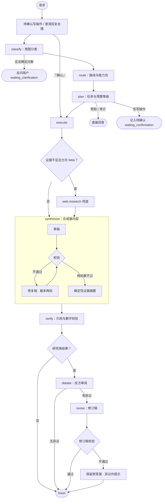

# Agent V2

Agent V2 是 Market Intelligence Workbench 当前默认的证据优先执行管线。它负责理解请求、选择能力、执行工具、汇总证据、生成回答并校验引用与数字，可由 Web 工作台和 Telegram 共同调用。

> [!WARNING]
> **已完成与 Agent V3 的统一条件对比测评**，结论见仓库根目录 README 文首和 [`v2/agent_bench/README.md`](../agent_bench/README.md)。目录中的单元测试、契约测试、离线固定样例和 benchmark/quality 工具是开发与回归基础设施，不构成投资系统有效性证明。

## 设计目标

- 先收集可追溯证据，再生成结论。
- 将路由、计划、工具执行、证据、合成和校验拆成清晰契约。
- 在 Web 与 Telegram 之间复用同一核心逻辑。
- 对数据缺失、工具失败和同一证据 id 下的不同说法进行显式降级；不做跨工具的数值比对。
- 写操作默认关闭；需要修改状态时先生成待确认操作。
- Web 搜索兜底使用服务端和请求级双重开关。

## 执行流程


```mermaid
flowchart TD
    A([请求]) --> P0[待确认写操作 / 澄清回复处理]
    P0 -- 「确认」--> X[execute]
    P0 --> C[classify：意图分类]
    C -- 无法确定对象 --> ASK([反问用户 · waiting_clarification])
    C --> R[route：路线与能力包]
    R --> PL[plan：任务与预算等级]
    PL -- 帮助 / 常识 --> D([直接回答])
    PL -- 含写操作 --> W([记入待确认 · waiting_confirmation])
    PL --> X
    X --> WF{证据不足且允许 Web？}
    WF -- 是 --> WEB[web.research 兜底]
    WF -- 否 --> S
    WEB --> S
    subgraph S [synthesize：合成器内部]
        direction TB
        S1[草稿] --> S2{校验}
        S2 -- 不通过 --> S3[修复稿 · 最多两轮]
        S3 --> S2
        S2 -- 两轮都不过 --> S4[确定性证据摘要]
    end
    S --> V[verify：引用与数字校验]
    V --> G{研究类结果？}
    G -- 否 --> F([finish])
    G -- 是 --> DB[debate：反方审阅]
    DB -- 无异议 --> F
    DB -- 有异议 --> RV[revise：修订稿]
    RV --> V2{修订稿校验}
    V2 -- 通过 --> F
    V2 -- 不通过 --> KEEP[保留原答案 · 异议作提示]
    KEEP --> F
```

图中的修复循环在合成器内部完成，编排器随后再校验一次；对抗审阅只在校验通过之后运行，修订稿必须再次通过校验才会替换原答案。

## 主要目录与文件

| 路径 | 作用 |
| --- | --- |
| `models.py` | 请求、计划、证据、工具结果和最终结果的数据契约 |
| `intent.py` / `routing.py` | 意图分类、实体识别与路由 |
| `planning.py` | 任务计划、依赖和预算 |
| `execution.py` | 能力注册、依赖执行和结果收集 |
| `catalog.py` | 可用能力及参数定义 |
| `adapters/` | 研究、行情、历史、实验室和 Web 等能力适配器 |
| `agents/` | 四个受限子流程：`move_attributor` 异动归因、`filing_reader` 申报阅读、`news_checker` 新闻核验、`debater` 反方审阅 |
| `evidence.py` / `verification.py` | 证据账本、引用与数字校验；`normalize_citations` 纠正模型写错前缀的证据 id |
| `judge.py` | 可选的模型裁判，判断一句话是否真的断言了它引用的事实 |
| `memory.py` | 跨会话的用户偏好记忆（“回答短一点”这类反馈） |
| `llm.py` / `synthesis.py` | 模型规划、回答合成与修复 |
| `session.py` / `session_store.py` | 会话上下文、记忆与持久化 |
| `runtime.py` / `warmup.py` | 离线、实时和工作台运行时的组装入口；服务启动时的预热 |
| `interfaces/` | Web 与 Telegram 输出适配 |
| `eval/` | 离线用例、固定夹具和评测脚手架；不是已完成的正式测评报告 |

共享契约和通用基础能力位于 `v2/agent_common/`。Agent V2 不依赖旧版 Slash Command orchestrator 作为核心运行时。

## 运行

在项目根目录安装依赖后，可运行不访问网络的固定演示：

```bash
poetry run python -m v2.agent_v2.run_demo
```

生产工作台通过 `build_workspace_agent()` 组装模型、研究引擎、行情、实验室和可选 Tavily 能力。Web 入口由 FastAPI 提供：

```text
POST /api/agent-v2/ask
GET  /api/agent-v2/jobs/{job_id}
```

实际运行需要根据启用的能力配置 `.env`。常用变量包括：

```text
AGENT_LLM_MODEL
AGENT_LLM_THINKING   # enabled / disabled；DeepSeek 默认开启思考，会显著拖慢每次调用并拒绝指定 tool_choice
AGENT_LLM_BASE_URL
AGENT_LLM_API_KEY
AGENT_V2_WEB_ENABLED
TAVILY_API_KEY
FINANCIAL_DATASETS_API_KEY
```

不要把真实密钥写入本目录或提交到 Git。

## 测试与现有评测工具

核心测试示例：

```bash
poetry run pytest v2/agent_v2/test_agent_v2.py v2/agent_v2/eval/test_benchmark.py -q
```

仓库还保留 `run_eval.py`、`run_benchmark.py` 和 `eval/quality.py` 等开发工具，用于离线回归和固定用例检查。与 V3 的正式对比测评在 [`v2/agent_bench/`](../agent_bench/README.md) 完成，`eval/quality.py` 的细则裁判被它原样复用。

该测评固定了以下条件：

1. 模型版本、温度和提示词版本。
2. 行情与研究数据快照及其时间点。
3. 开发集、隐藏测试集和评分标准。
4. 每题工具调用、搜索、token 和时间预算。
5. 引用正确性、评分细则符合度与成对盲评；延迟、费用与失败恢复未作为指标纳入。
6. 人工复核（20 对回答）和可复现的原始运行记录。

## 当前限制

- 结果质量受外部数据源覆盖、延迟和 API 权限影响。
- 模型路由、计划和合成策略仍可能调整，接口不承诺长期冻结。
- 离线夹具无法代表实时市场中的数据冲突与供应商故障。
- Web 兜底可能增加费用与延迟，默认应保持受限。
- 任何交易或状态修改都不应绕过人工确认和券商风控。

## 与 Agent V3 的关系

Agent V2 是框架无关、较轻量的默认执行路径；Agent V3 使用 LangGraph 构建显式状态图和可恢复任务。两者共享部分能力和证据语义，但执行器彼此独立。统一条件下的对比测评表明两者水平相当：V2 强在覆盖面（账户、关注列表、调查、申报内容），V3 强在字段级证据与口径。版本号不表示优劣。
